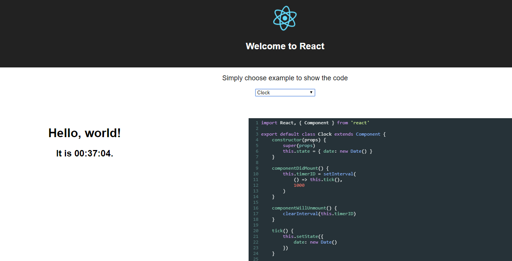

Simple application to directly view components examples and the corresponding code in reactjs

If you are using vscode, you can easily debug with the preconfigured recipe

In order to run the project, make sure you have an updated version of node >= 8.1

To run :
````
npm install
npm run start
````


